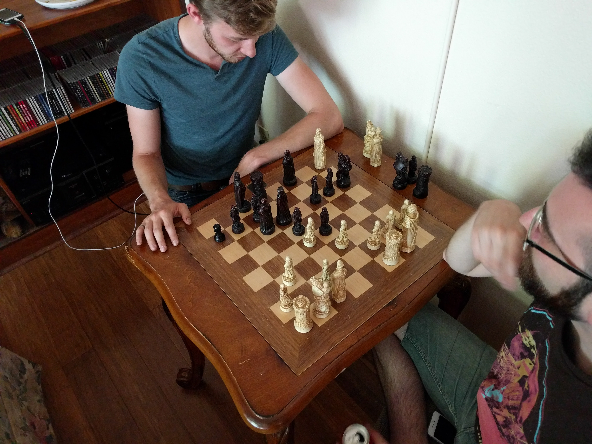

# Chessboard Detection

## Goal

* Given a photo with a chess board in it, find the chessboard grid.

This is to be an evolution on [Tensorflow Chessbot](https://github.com/Elucidation/tensorflow_chessbot), working with real images.

### Example input image

## Some constraints:

* Chessboard can be populated with pieces, possibly partially occluded by hands etc. too
* Background can be crowded
* No user input besides the image taken

## Prior Work

There exists checkerboard detection algorithms, but they assume no occlusions, consistent black/white pattern, and clean demarcation with the background. We may be dealing with textured/patterned surfaces, heavy occlusion due to pieces or people's hands, etc., and the background may interrupt to the edges of the chessboard.

## Current Work

A promising approach is Gradient Angle Informed Hough transforms to find chessboard lines, once again taking advantage of the alternating gradient angles of the internal chessboard tiles.
